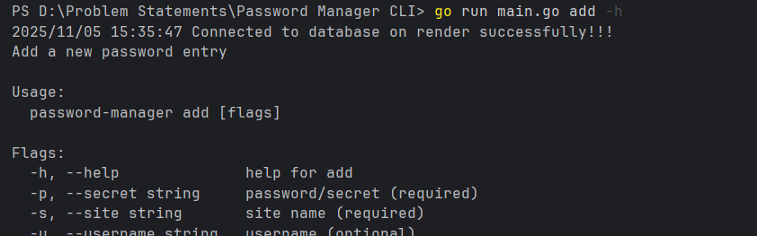
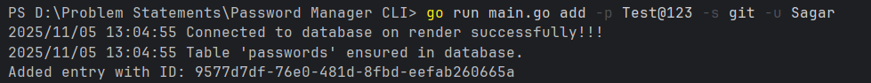
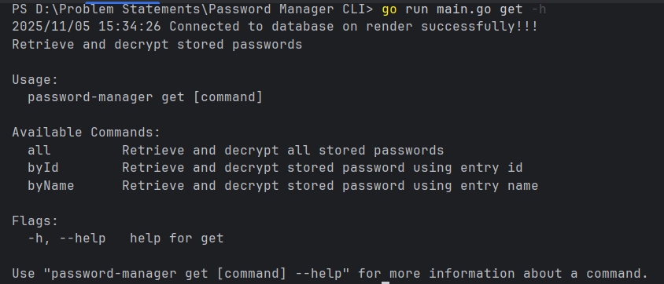
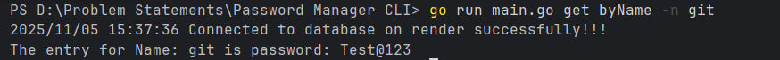
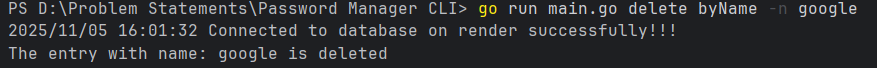

# Password Manager CLI

## Setup

1. Clone Project
2. Set environment variables (DB_HOST, DB_PORT, DB_USER, DB_PASS, DB_NAME, MASTER_KEY).
3. Initialize table by own on render or by uncommenting the corresponding codes in main file.
4. Run the project.

## Example

```bash

# run(to know about commands -h flag)
go run main.go -h
go run main.go add -h
go run main.go get -h
go run main.go update -h
go run main.go delete -h
```

## Sample Run Examples
> The following are the example of commands.

- **Add Command**
---
-help

     

-main

  

---

- **Get Command**
---
-help



-by id


-by name



-all


---

- **Update Command**
---
-help


-main


---

- **Delete Command**
---
-help


-by id


-by name



---

